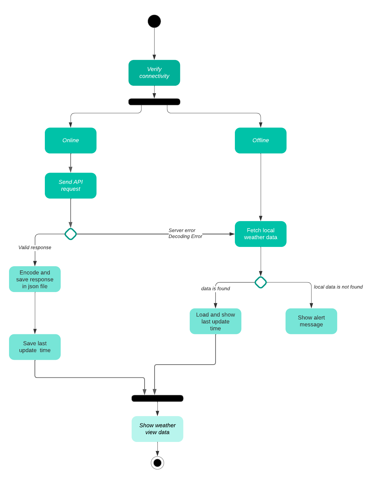
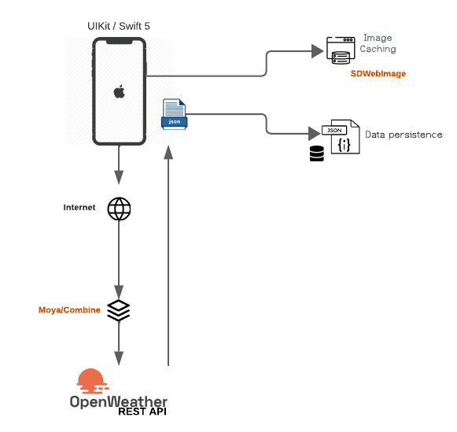

# Weather App - Technical Choices

## Global view

## Programming Language
Swift 5

## Architecture Choice
**MVVM with Coordinator Pattern**

In designing and implementing the weather app, I embraced the MVVM pattern augmented by the Coordinator pattern. This strategic decision aligns with the specified development practices in the job offer, demonstrating a commitment to clean, maintainable, and scalable code.

## Networking
**Moya for Abstracting Network Calls**
**Combine**

## Data Storage
**Local JSON File Storage**

To persistently store weather data fetched from the API, the app employs a straightforward approach of saving the entire API response in a local JSON file. This choice is rooted in the simplicity of our data structure and the non-sensitive nature of weather information.

### Advantages
- **Simplicity:** Storing data in a local JSON file simplifies both reading and writing operations due to the uncomplicated data structure.

- **No Need for Complex Database:** With no complex relationships or advanced querying needs, a full-fledged database solution like Core Data, MySQL, or SwiftData is deemed unnecessary, avoiding unnecessary complexity.

### Considerations
- **Limited to Simple Data Structures:** Ideal for applications with uncomplicated data structures and minimal need for relational database features.

**User Defaults for Last Update Time**

UserDefaults store the timestamp of the last successful API call, providing a lightweight and convenient solution for storing small pieces of data, such as a timestamp.

### Considerations
- **Suitable for Timestamps:** UserDefaults is ideal for storing simple data like timestamps but may not be suitable for more extensive or complex data storage requirements.

## UI Framework
**UIKit**

## Retrieval from Local Storage
Data is retrieved from local storage under the following conditions:

- **Server Error:** In case of a server error during an API call, the app falls back to retrieving data from the locally stored JSON file.

- **Offline Mode:** If the device is offline, the app switches to using the locally stored data.

### Considerations for Sensitive Data
For applications dealing with sensitive data, alternative strategies like short polling or long-polling may be more appropriate.

**Short Polling:**
- Regularly polls the server for updates at fixed intervals.
- Suitable for scenarios where near real-time updates are essential.

**Long Polling:**
- Establishes a persistent connection with the server, waiting for updates.
- Efficient for scenarios where updates are infrequent, reducing unnecessary network requests.

The choice between these strategies depends on the nature of the application and the importance of real-time data updates.

The decision to load data from local storage in this weather app balances providing up-to-date information and ensuring a responsive experience, considering the periodic nature of weather forecast updates.

## Dependency Management
**CocoaPods**

## Testing
**Quick and Nimble**

## Other Technologies
- **Reachability:** For internet connection checking.
- **SDWebImage:** For image loading and caching.
